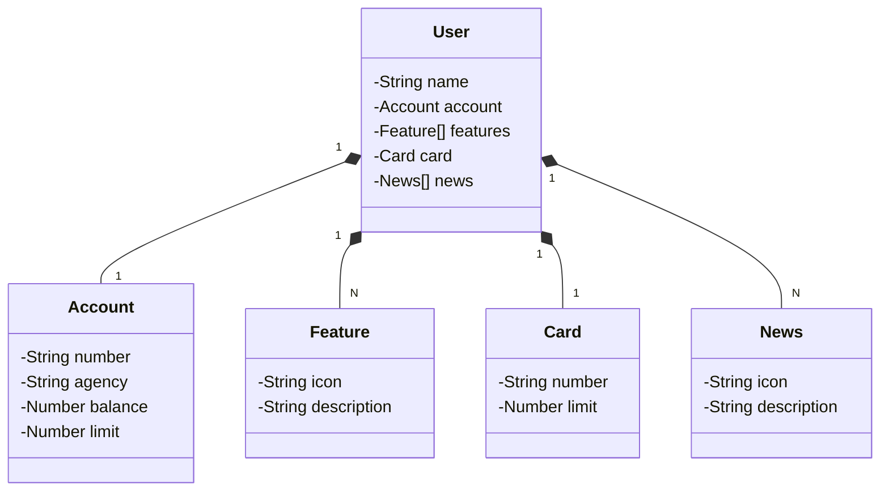

# Criando-uma-API-Rest-na-Nuvem
Iniciando a criação de uma API Rest na Nuvem com o Spring Boot Inicialazr como requisito para concluir o Bootcamp Back-End Java oferecido por uma parceria entre a [DIO](https://www.dio.me/sign-up?ref=AF09NCKTFOJE) e o Santander.

[Confira aqui o Projeto Criado no Inicialazr](https://start.spring.io/#!type=gradle-project&language=java&platformVersion=3.1.4&packaging=jar&jvmVersion=17&groupId=me.dio&artifactId=DevWeekSantander2023&name=DevWeekSantander2023&description=API%20Rest%20Java%20na%20Dev%20Week&packageName=me.dio.DevWeekSantander2023&dependencies=web,data-jpa,h2,postgresql)

# O Projeto também faz parte da Santander Dev Week 2023

Java RESTful API criada para a Santander Dev Week.

## Principais Tecnologias
 - **Java 17**: Foi utilizado a versão LTS mais recente do Java para tirar vantagem das últimas inovações que essa linguagem robusta e amplamente utilizada oferece;
 - **Spring Boot 3**: É a versão mais recente do Spring Boot, na data da criação do projeto, que maximiza a produtividade do desenvolvedor por meio de sua poderosa premissa de autoconfiguração;
 - **Spring Data JPA**: A ferramenta pode simplificar a camada de acesso aos dados, facilitando a integração com bancos de dados SQL;
 - **OpenAPI (Swagger)**: A documentação da API pode ser eficaz e fácil de entender usando a OpenAPI (Swagger), perfeitamente alinhada com a alta produtividade que o Spring Boot oferece;
 - **Railway**: facilita o deploy e monitoramento das soluções na nuvem, além de oferecer diversos bancos de dados como serviço e pipelines de CI/CD.

## [Link do Figma](https://www.figma.com/file/0ZsjwjsYlYd3timxqMWlbj/SANTANDER---Projeto-Web%2FMobile?type=design&node-id=1421%3A432&mode=design&t=6dPQuerScEQH0zAn-1)

O Figma foi utilizado para a abstração do domínio desta API, sendo útil na análise e projeto da solução.

## Diagrama de Classes (Domínio da API)

## IMPORTANTE

Este projeto foi construído com um viés totalmente educacional para a DIO. Por isso, disponibilizamos uma versão mais robusta dele no repositório oficial da DIO:

### [digitalinnovationone/santander-dev-week-2023-api](https://github.com/digitalinnovationone/santander-dev-week-2023-api)

Nele está incluído todas os endpoints de CRUD, além de aplicar boas práticas (uso de DTOs e refinamento na documentação da OpenAPI). Sendo assim, caso queira um desafio/referência mais completa é só acessar 👊🤩